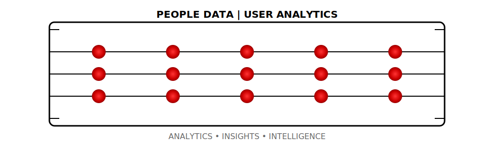

# Hi, I'm Vahid 👋

  
  
  

## About Me

Transforming text data into intelligent products. Specialized in people, user data across Finance, HR, and Tech domains.

## Focus Areas

- Data Product Architecture & Governance
- People Data and Data Monetization
- Cross-Domain Product
- LLM Solutions for HR (Skills, Hiring, Metrics)

## Tech Stack

## 📚 DataCamp Portfolio

  

### Completed Tracks
- 🏆 Data Scientist with Python
- 🏆 Python Programmer
- 🏆 Data Analyst in SQL
- 🏆 Machine Learning Scientist

### Recent Certificates
- [Data Science for Business](https://www.datacamp.com/statement-of-accomplishment/track/xxx)
- [Python Programming](https://www.datacamp.com/statement-of-accomplishment/track/xxx)
- [SQL Fundamentals](https://www.datacamp.com/statement-of-accomplishment/track/xxx)

## Key Projects

  

- **LLM Pipeline**: Data processing framework
- **Insights**: Data Driven Products

## Stats

  
  

## Connect

  

  

---

  

